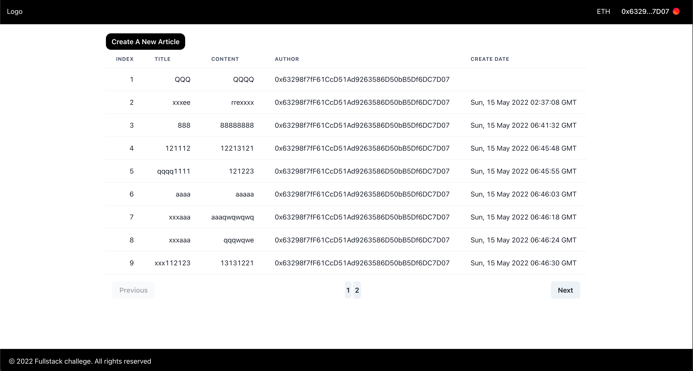

# Full-stack Engineer Challenge

The challenge consists of two parts:

- [Code Challenge](./CodeChallenge.md)
  
- [Written Challenge](./WrittenChallenge.md)

Please clone this repo and submit your work in a seperate fork.

The challenges are designed to demonstrate the applicant's way of thinking and personal passions. All challenges are open ended, so please feel free to frame the questions as you see fit, or answer them in any way that you think interesting and revealing.

Enjoy and good luck!

## Getting Started

### Prerequisites

- node version >= 16

### Installation

Clone the repo

```sh
git clone git@github.com:NoctisHsu/fullstack-challenge.git
```

Install NPM packages

server

```sh
cd server
yarn install
```

client

```sh
cd client
yarn install
```

<!-- USAGE EXAMPLES -->

## Usage

server

1. Build with TypeScript
   ```sh
   npm run build
   ```
2. Run application (watch)
   ```sh
   npm run dev
   ```
3. Run application

   ```sh
   npm start
   ```

client

1. Build with TypeScript
   ```sh
   npm run build
   ```
2. Run application (watch)
   ```sh
   npm run dev
   ```
3. Run application
   ```sh
   npm start
   ```
4. Run lint check
   ```sh
   npm run lint
   ```
